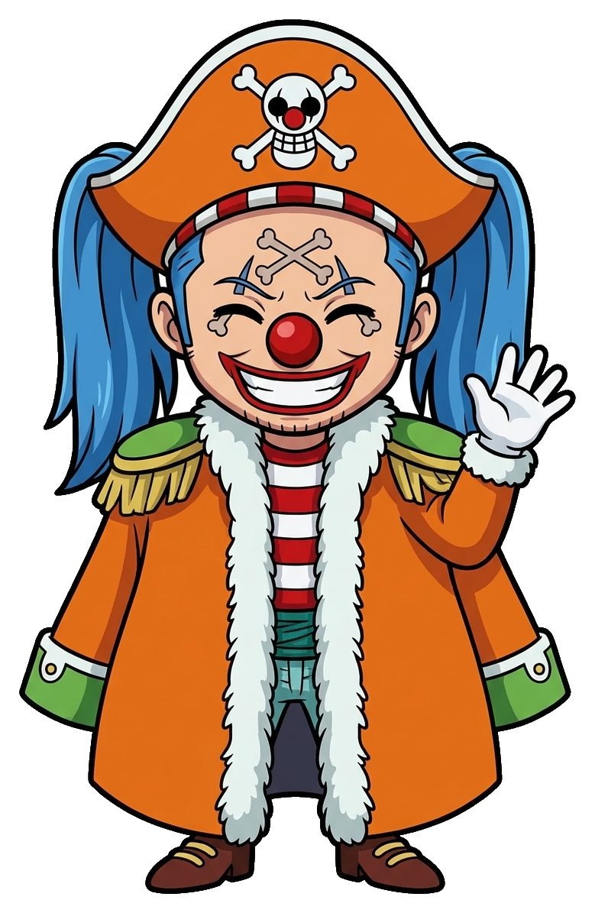
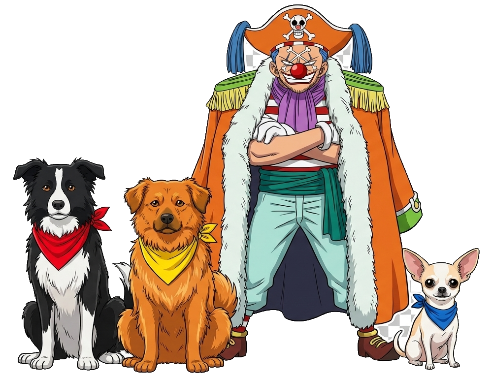

<div align="center">



# 🏴‍☠️ Prep Veterinaria ⚓

### _La ciurma di Buggy salpa verso il camice — e kamoooon!_ 🤡🩺

**Il tesoro:** aiutare **Thomas** a superare il **semestre filtro di Veterinaria**

🧲 **Fisica** · 🧬 **Biologia** · ⚗️ **Chimica**

<br/>

[](https://LeoBacca.github.io/thomas-vet-prep/)


</div>

---

## 🗺️ La rotta — 3 sezioni (isole separate!)

| 🏝️ Isola | A cosa serve |
|---|---|
| 📖 **Tutorial** | Come funziona il sito e **come si studia** (il metodo). |
| 📚 **Risorse** | La wiki dei concetti: **1 pagina = 1 concetto**, spiegato semplice, con diagrammi a mano e video. _Qui si capisce._ |
| 🎯 **Studio** | **Flashcard + ripasso intelligente (FSRS) + gamification** (XP, livelli, streak, medaglie, sfide). _Qui si allena la memoria._ |

> 🪙 **Il ponte d'oro:** quando in *Studio* sbagli una flashcard, un link ti riporta dritto al concetto nelle *Risorse*. Imparare → ripassare → tornare a imparare. 🔁

---

## 🃏 Per Thomas (la ciurma)

1. ⚓ Apri il link: **https://LeoBacca.github.io/thomas-vet-prep/**
2. 📱 Sul telefono: **«Aggiungi alla schermata Home»** → lo usi come un'app.
3. 🧠 Studia. **I progressi si salvano da soli** — niente bottoni "salva".
4. ☁️ Vuoi studiare su **telefono E PC**? In **Studio → 💾 Dati → «☁️ Sincronizza»** fai login con Google **una volta per dispositivo**: da lì in poi i progressi viaggiano da soli su tutte le tue navi. 🚢

> 🏴‍☠️ **Niente Solani:** poco ma ogni giorno e diventi il GOAT. 🐐

---

## ☁️ Sincronizzazione tra dispositivi

I progressi vivono nel **browser** (offline-first, velocissimi). Se accedi con Google diventano anche **cloud** e si **fondono** tra i dispositivi — senza perdere niente.

- 🔑 **Login una volta** per device (Google) → poi è **automatico**: scarica all'apertura, ricarica dopo ogni modifica.
- 🛟 **Merge sicuro:** un «letto» non sparisce mai, le card prendono il ripasso più recente, XP/streak/medaglie il massimo. Anche due dispositivi con progressi diversi si **uniscono**.
- 🆓 **Gratis:** Firebase Firestore (free tier), dati minuscoli, niente carta di credito.

🔧 Dettagli tecnici: [`src/scripts/studio/sync.js`](src/scripts/studio/sync.js) (merge + orchestrazione), [`cloud.js`](src/scripts/studio/cloud.js) (wrapper Firebase), [`firebase-config.js`](src/scripts/studio/firebase-config.js) (chiavi pubbliche).

---

## ⚓ Per il Capitano Leo (manutenzione)

### 🧭 Le 3 regole d'oro — perché i progressi di Thomas NON si perdono mai

I progressi (flashcard SRS + spunte "letto") stanno nel **`localStorage` del browser di Thomas** (+ backup cloud Firebase). La build è solo "l'app": puoi ripubblicarla mille volte, i dati restano. Per non affondare il tesoro, **non violare mai**:

1. 🧭 **Stesso URL.** Non rinominare il repo `thomas-vet-prep` né cambiare `base` in `astro.config.mjs`. Cambiare indirizzo = link rotti + punto d'accesso salvato da Thomas perso.
2. 🔑 **Stesse chiavi `localStorage`:** `prep:studio` (Studio/SRS) e `prep:progress` (spunte Risorse), in [`store.js`](src/scripts/studio/store.js) e [`BaseLayout.astro`](src/layouts/BaseLayout.astro). Non rinominarle.
3. 🧬 **Se cambi la forma dei dati**, alza `SCHEMA_VERSION` ed estendi `migrate()` in `store.js` (fa già merge non distruttivo): i salvataggi vecchi vengono *aggiornati*, non cancellati.

> 💎 Rispettando queste 3 regole puoi aggiungere materie, pagine e feature all'infinito: **lo storico di Thomas resta invariato.**

### 🚀 Pubblicare un aggiornamento

Ogni `git push` su `main` ribuilda e ripubblica da solo (GitHub Actions → [`.github/workflows/deploy.yml`](.github/workflows/deploy.yml)).

```bash
git add -A
git commit -m "e kamoooon, aggiornamento"
git push            # ~1-2 min e il sito online è aggiornato; i progressi di Thomas restano
```

### 🛠️ Avvio in locale

```bash
npm install
npm run dev      # di solito http://localhost:4321/thomas-vet-prep/
npm run build    # genera il sito statico in dist/
npm run preview  # anteprima del sito buildato
```

### 🗂️ Come è organizzata la nave

```
content/topics/<materia>.json   # FONTE DI VERITÀ: argomenti atomici per unità (id, obiettivo, prereq...)
scripts/generate-unit.mjs       # genera indice + pagine skeleton da quel JSON
src/data/<materia>-index.json   # indice generato (NON modificare a mano)
src/data/flashcards/*.json      # i mazzi di flashcard (chimica/fisica/biologia)
src/pages/risorse/...           # le pagine wiki (1 file MDX per concetto)
src/pages/studio/...            # sezione Studio (dashboard, sessione SRS, sfida)
src/scripts/studio/             # SRS (fsrs.js), stato (store.js), gioco (game.js),
                                #   medaglie, + sync cloud (cloud.js, sync.js, firebase-config.js)
src/layouts/  src/components/    # impaginazione, Mascotte, Diagram (Mermaid), YouTube
public/mascotte/                # Buggy + i 3 cani (🐶 la ciurma)
```

### ✍️ Aggiungere/rigenerare contenuti

1. Modifica `content/topics/<materia>.json` (argomenti, prerequisiti, `correlati`).
2. `npm run gen:fisica` (o la materia) per rigenerare indice e skeleton (la 1ª scheda di ogni unità non viene sovrascritta).
3. Scrivi il contenuto vero nei `.mdx` (testo + `<Diagram>` + `<YouTube>`).

---

## 🐶 La ciurma

<div align="center">



**Capitan Buggy** 🤡 + i tre mozzi a quattro zampe 🐾 — accompagnano Thomas, lo incoraggiano quando sbaglia (e ogni tanto lo crepano per ridere) e festeggiano gli obiettivi. Un pazzo frate.

</div>

---

## 📊 Stato della nave

- ✅ Scaffold completo + 3 sezioni (Tutorial / Risorse / Studio)
- ✅ **Risorse complete** per Fisica, Biologia e Chimica (wiki di concetti con diagrammi + video)
- ✅ **Flashcard** generate per tutte e 3 le materie
- ✅ **Studio**: SRS (FSRS-5), XP/livelli, streak, medaglie, sfida a tempo + tema Buggy 🃏
- ✅ Salvataggio automatico (localStorage) con migrazione non distruttiva
- ✅ **Sync cloud** tra dispositivi (Firebase, login Google) 🆕
- ⬜ Eventuali buchi di Biologia dei compiti d'esame (anatomia/fisiologia/ecologia) → prima Risorse, poi flashcard

<div align="center">

⚓ _Fatto con cura (e un po' di sale) per Thomas — e kamoooon!_ 🏴‍☠️

_Patternani approva. Official._ 🐐

</div>
